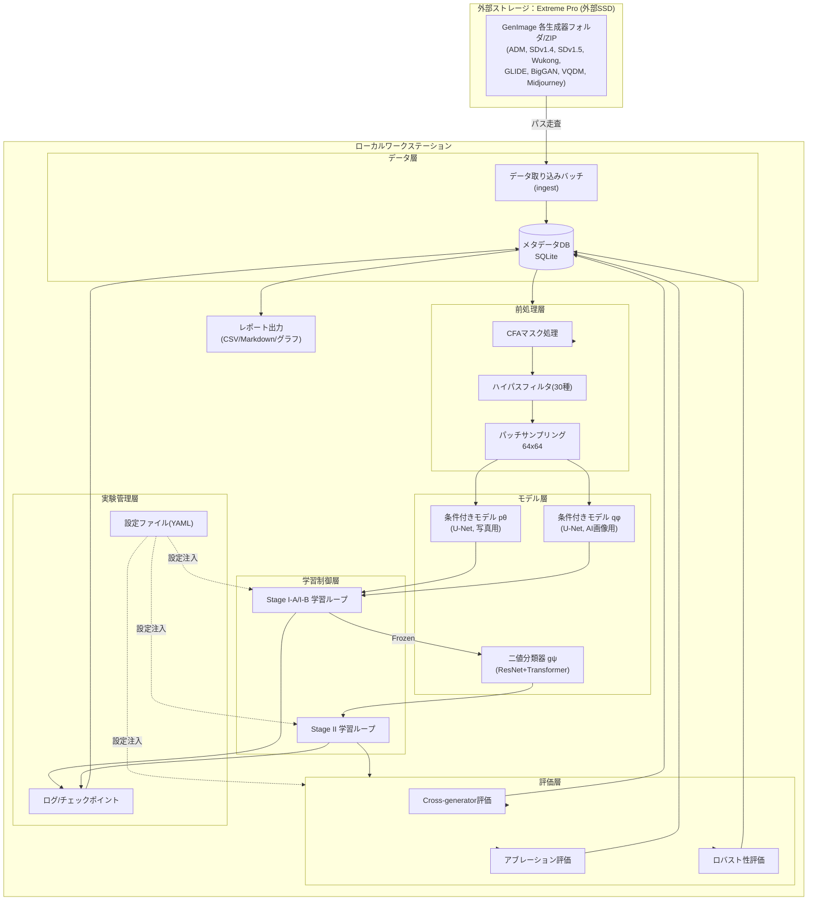
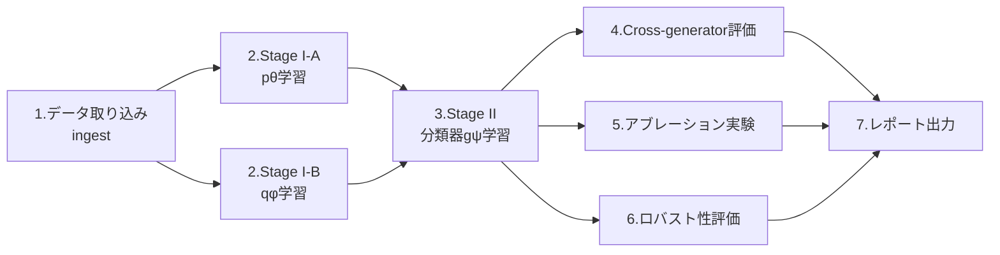
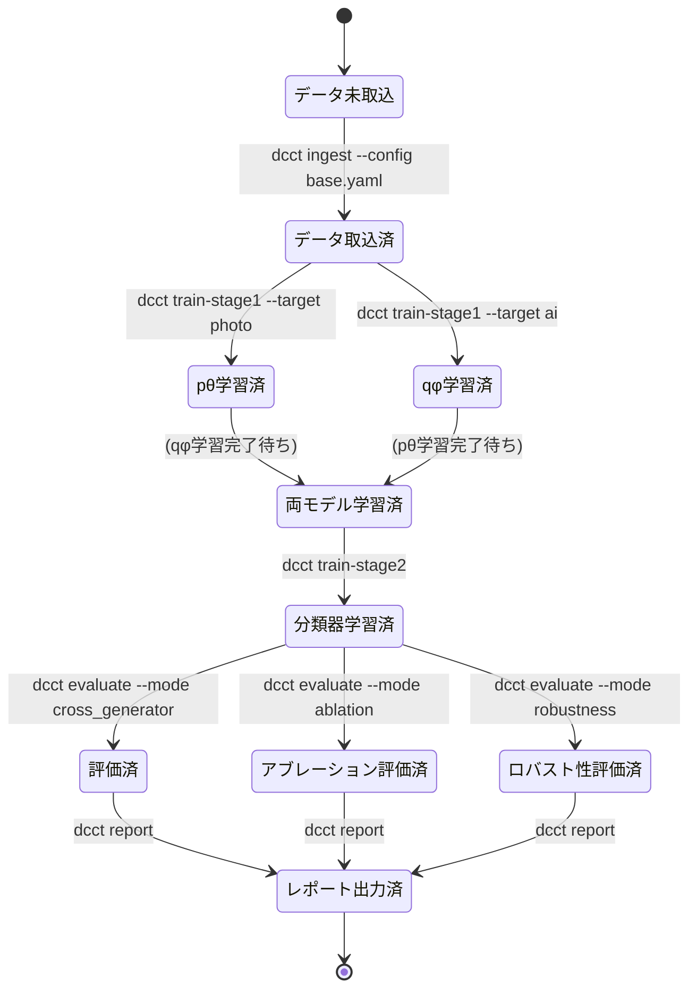

# 基本設計書：DCCT（Color Matters）再現実装

**担当ロール:** basic-designer
**参照元:** 01_要件定義書_DCCT再現実装.md
**作成日:** 2026年9月
**ステータス:** 草稿

---

## 1. システム概要

本システムは、DCCT論文の手法（CFAマスク→ハイパスフィルタ→条件付き分布モデル学習→二値分類器学習→評価）をローカル環境で再現するための、CLIベースの機械学習実験パイプラインである。GUIを持たないバッチ処理システムであるため、本書では要件定義における「画面遷移」に相当する項目を「**CLIコマンド遷移（実行フロー）**」として整理する。

## 2. システム構成図



## 3. モジュール構成一覧

| モジュール | 役割 | 主なファイル(想定) |
|---|---|---|
| `data.ingest` | 外部SSD上のデータセットを走査し、DBへメタデータ登録 | `ingest.py` |
| `data.repository` | DBアクセス層（CRUD） | `repository.py` |
| `preprocess.cfa` | Bayer CFAマスク生成・適用 | `cfa_mask.py` |
| `preprocess.highpass` | SRM 30種ハイパスフィルタ・truncation | `highpass.py` |
| `preprocess.sampler` | パッチサンプリング（学習時ランダム／推論時P枚） | `patch_sampler.py` |
| `model.unet` | 条件付き分布モデル（U-Net＋混合ロジスティック出力） | `conditional_unet.py` |
| `model.classifier` | 二値分類器（ResNet＋Transformer） | `classifier.py` |
| `model.losses` | NLL損失、BCE損失 | `losses.py` |
| `train.stage1` | Stage I-A/I-B 学習制御 | `train_stage1.py` |
| `train.stage2` | Stage II 学習制御 | `train_stage2.py` |
| `eval.cross_generator` | Table 1相当のcross-generator評価 | `eval_cross_generator.py` |
| `eval.ablation` | Table 4相当のアブレーション実行 | `eval_ablation.py` |
| `eval.robustness` | Figure 6相当のロバスト性評価 | `eval_robustness.py` |
| `experiment.config` | 実験設定の読み込み・検証 | `config.py` |
| `experiment.tracker` | 実験ID発行・ログ・チェックポイント管理 | `tracker.py` |
| `report.builder` | 結果集計・レポート出力 | `report_builder.py` |
| `cli` | コマンドラインエントリポイント | `cli.py` |

## 4. 処理全体のフロー概要



Stage I-A（pθ）とStage I-B（qφ）は互いに独立した学習であり、並列実行が可能。両者が完了しFrozenになった時点でStage IIに進む（詳細は詳細設計書 3節）。

## 5. ディレクトリ構成（案）

```
dcct-reproduction/
├── configs/
│   ├── base.yaml                # 共通設定（パス、seed等）
│   ├── stage1_photo.yaml        # pθ学習設定
│   ├── stage1_ai.yaml           # qφ学習設定
│   ├── stage2_classifier.yaml   # 分類器学習設定
│   └── ablation/
│       ├── ablation_a_dual_model.yaml
│       ├── ablation_b_structure.yaml
│       ├── ablation_c_truncation.yaml
│       └── ablation_d_finetune.yaml
├── src/
│   ├── data/
│   ├── preprocess/
│   ├── model/
│   ├── train/
│   ├── eval/
│   ├── experiment/
│   ├── report/
│   └── cli.py
├── db/
│   └── dcct_metadata.sqlite3
├── checkpoints/
│   ├── stage1_photo/
│   ├── stage1_ai/
│   └── stage2_classifier/
├── logs/
├── reports/
└── README.md
```

外部SSD（Extreme Pro）のマウントパスは `configs/base.yaml` の `dataset_root` に外出しし、コード側にハードコードしない（NFR-5対応）。

## 6. 実行フロー（CLIコマンド遷移）

本システムにGUI画面は存在しないため、利用者から見た「操作の流れ」はCLIコマンドの遷移として定義する。



代表的なコマンド例:

| コマンド | 内容 |
|---|---|
| `dcct ingest --config configs/base.yaml` | 外部SSD上のGenImageを走査しDBへ登録 |
| `dcct train-stage1 --target photo --config configs/stage1_photo.yaml` | pθを学習 |
| `dcct train-stage1 --target ai --config configs/stage1_ai.yaml` | qφを学習 |
| `dcct train-stage2 --config configs/stage2_classifier.yaml` | 分類器gψを学習 |
| `dcct evaluate --mode cross_generator --experiment-id <ID>` | Table1相当の評価 |
| `dcct evaluate --mode ablation --config configs/ablation/ablation_c_truncation.yaml` | アブレーション実行 |
| `dcct report --experiment-id <ID> --out reports/` | 結果レポート出力 |

## 7. 外部インタフェース

| インタフェース | 内容 |
|---|---|
| データセット入力 | 外部SSD上のディレクトリ／ZIP（GenImage）。`dataset_root` 設定でパスを指定。macOSでは `/Volumes/Extreme Pro/...` のようにマウントポイント配下となり、パスに空白を含むためconfig内でクォートすること。ターミナル／Pythonプロセスに「フルディスクアクセス」権限の付与が必要になる場合がある |
| 設定ファイル | YAML形式。ハイパーパラメータ、パス、アブレーション条件を定義 |
| メタデータDB | SQLiteファイル（04_DB設計書 参照） |
| チェックポイント | PyTorchの `.pt` ファイル。DB上のパスと1対1で紐づく |
| レポート出力 | CSV／Markdown表／画像（グラフ）としてローカルファイルに出力 |

## 8. 非機能設計方針

| 方針 | 内容 |
|---|---|
| ロギング | 学習・評価の各ステップで標準ログ（epoch, loss, lr等）とDBへのサマリ書き込みを両立する |
| 再現性 | `configs/base.yaml` にグローバルseedを定義し、データ分割・モデル初期化・パッチサンプリングに一貫して適用する |
| 設定管理 | 全てのハイパーパラメータ・パス・アブレーション条件はYAML化し、コード変更なしに実験を切り替え可能にする（NFR-5, NFR-7対応） |
| モジュール分離 | データ／前処理／モデル／学習／評価／DBアクセスを疎結合にし、単体テスト・アブレーション時の一部差し替えを容易にする（NFR-4対応） |
| 障害耐性 | 学習中断時に直近チェックポイントから再開できるようにする |

## 9. 実行環境に関する補足（macOS / Apple Silicon）

- **デバイス選択:** 起動時に`torch.backends.mps.is_available()`を確認し、利用可能なら`mps`、不可なら`cpu`を選択するデバイス抽象化を`experiment.config`に持たせる。CUDA固有のコード（`torch.cuda.*`）は使用しない。
- **MPS未対応演算への対策:** 一部のPyTorch演算がMPSバックエンドで未実装の場合に備え、環境変数`PYTORCH_ENABLE_MPS_FALLBACK=1`を既定で設定し、該当演算のみCPUへ自動フォールバックさせる。
- **単一GPU前提:** Apple SiliconはGPUが1基（Unified Memory共有）であるため、マルチGPU分散学習は設計対象外とする（NFR-2の性能要件は単一Apple Silicon GPUでの実測値をベースラインとする）。
- **外部SSDのファイルシステム:** APFS（大文字小文字を区別する設定/しない設定がある）かexFATかにより、パスの大文字小文字の扱いが異なる場合がある。`ingest`実装ではパス比較を大文字小文字非依存にしない（区別する）方針とし、DB登録時のパスはOSから取得した実パスをそのまま保存する。
