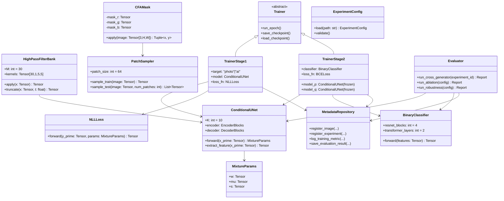

# 詳細設計書：DCCT（Color Matters）再現実装

**担当ロール:** detailed-designer
**参照元:** 01_要件定義書, 02_基本設計書
**根拠:** 論文 Algorithm 1（Training Phase）/ Algorithm 2（Inference Phase）、Sec.3系実装詳細節、Table 4アブレーション、Fig.6/7
**作成日:** 2026年9月
**ステータス:** 草稿

---

## 1. 処理フロー詳細

### 1.1 パラメータ一覧（論文既定値）

| 記号/名称 | 既定値 | 説明 |
|---|---|---|
| パッチサイズ *s* | 64 | 学習時ランダムクロップサイズ（64×64×3） |
| 混合成分数 *K* | 10 | ロジスティック混合分布の成分数 |
| truncation閾値 *t* | 7 | ハイパスフィルタ後の残差クリップ範囲 [-t, t] |
| ハイパスフィルタ数 *M* | 30 | SRM由来 5×5カーネル（Fridrich & Kodovsky, 2012） |
| Optimizer | Adam | 条件付きモデル・分類器とも共通 |
| 学習率 | 1e-4 | 条件付きモデル・分類器とも共通 |
| バッチサイズ | 16 | 条件付きモデル・分類器とも共通 |
| JPEG拡張 | QF〜U(70,100)、適用確率5% | 学習時のベナイン摂動 |
| テスト時パッチ数 *P* | 16 | 推論時に1画像から抽出し平均するパッチ数 |
| 判定閾値 τ | 要チューニング（既定0.5を初期値とする） | 分類器スコアの二値化閾値 |

### 1.2 Stage I-A / I-B：条件付き分布モデルの学習（Algorithm 1 前半）

```
for each epoch:
    for each mini-batch I ~ D  (D = 写真データセット or AI画像データセット):
        I~ ← RandomCrop(I, s=64)
        x  ← CFAMask適用(I~)            # 観測1chを残し、他2chはマスク
        y  ← PackMissingChannels(I~)     # 隠した残り2ch（正解）
        x' ← Truncate(Stack([h_m * x for m in 1..M]), -t, t)
        y' ← Truncate(Stack([h_m * y for m in 1..M]), -t, t)
        {w_k, mu_k, s_k}_{k=1..K} ← UNet(x')     # 画素ごとの混合ロジスティックパラメータ
        p(y'|x') = Π_(i,j) Σ_k w_k(i,j) * Logistic(y'(i,j) | mu_k(i,j), s_k(i,j))
        loss_NLL = -log p(y'|x')
        パラメータ更新（Adam, lr=1e-4）
```

- pθはD=写真データセットのみ、qφはD=AI生成データセットのみで**独立に**学習する（両者は重み共有しない）。
- 収束後、両モデルのパラメータをFrozen（勾配停止）にする。

### 1.3 Stage II：分類器gψの学習（Algorithm 1 後半）

```
for each epoch:
    for each mini-batch (I, c) ~ D_photo ∪ D_AI:   # c=0(写真) or 1(AI)
        I~ ← RandomCrop(I, s=64)
        x  ← CFAMask適用(I~)
        x' ← Truncate(Stack([h_m * x for m in 1..M]), -t, t)
        f_p ← fθ(x')   # Frozen pθから抽出した特徴
        f_q ← fφ(x')   # Frozen qφから抽出した特徴
        c_hat ← gψ(Concat(f_p, f_q))
        loss_cls = BCE(c_hat, c)
        gψのパラメータ更新（Adam, lr=1e-4）
```

> **設計上の要確認事項（重要）:** 論文Algorithm 1 の32行目は `gψ(CONCAT(fθ(x′), fϕ(x′)))` としか記述されておらず、fθ/fφが「最終的な混合分布パラメータ {w,μ,s}（K×3チャンネル相当の特徴マップ）」を返すのか、「その手前のU-Net中間特徴マップ」を返すのかは論文本文からは一意に確定できない。本実装では以下の**案A**を第一候補として採用し、必要に応じて**案B**とのアブレーション比較を行う（4.9節参照）。
> - **案A（採用）:** U-Netの最終出力層（画素ごとの {w_k, μ_k, s_k}, k=1..K）をそのまま特徴マップ（チャンネル数 = 3K = 30）として利用し、fθ・fφの出力（各30ch, 64×64）をチャンネル方向にConcatし60chの特徴マップとしてgψに入力する。
> - **案B（代替）:** U-Netのデコーダ最終層手前のボトルネック特徴（任意次元）を特徴マップとして利用する。

### 1.4 推論フェーズ（Algorithm 2）

```
for p in 1..P:                              # P=16
    I~_p ← RandomCrop(I_test, s=64)
    x_p  ← CFAMask適用(I~_p)
    x'_p ← Truncate(Stack([h_m * x_p for m in 1..M]), -t, t)
    s_p  ← gψ(Concat(fθ(x'_p), fφ(x'_p)))
s_bar ← mean(s_1, ..., s_P)
c_hat ← 1 if s_bar > τ else 0
return s_bar, c_hat
```

---

## 2. クラス設計



## 3. 各クラスの入出力仕様

### 3.1 `CFAMask`

| メソッド | 入力 | 出力 | 説明 |
|---|---|---|---|
| `apply(image)` | `Tensor[3,64,64]`（RGBパッチ） | `x: Tensor[1,64,64]`, `y: Tensor[2,64,64]` | Bayerパターンに従い、画素位置ごとにR/G/Bいずれか1chを残しxとする。残り2chをyとしてパック |

### 3.2 `HighPassFilterBank`

| メソッド | 入力 | 出力 | 説明 |
|---|---|---|---|
| `apply(x)` | `Tensor[C,64,64]` | `Tensor[30*C,64,64]` | 30種の5×5カーネルで畳み込み、チャンネル方向に積み上げ |
| `truncate(x, t)` | `Tensor` | `Tensor`（同shape） | `clamp(x, -t, t)` |

### 3.3 `ConditionalUNet`（fθ / fφ 共通クラス、インスタンスごとに独立重み）

| メソッド | 入力 | 出力 | 説明 |
|---|---|---|---|
| `forward(x')` | `Tensor[30,64,64]` | `MixtureParams`（w,μ,s 各 `Tensor[K,2,64,64]`） | 画素ごとにK個の(w,μ,s)を出力。yは2chなのでμ,sも2ch分 |
| `extract_feature(x')` | `Tensor[30,64,64]` | `Tensor[3K*2? or Cf,64,64]` | Stage II分類器向け特徴抽出（1.3節の案A/B切替） |

### 3.4 `NLLLoss`

| メソッド | 入力 | 出力 | 説明 |
|---|---|---|---|
| `forward(y', params)` | `y': Tensor[2,64,64]`, `params: MixtureParams` | スカラー | 画素ごとの混合ロジスティック尤度の対数を全画素で総和し符号反転 |

### 3.5 `BinaryClassifier`

| メソッド | 入力 | 出力 | 説明 |
|---|---|---|---|
| `forward(features)` | `Tensor[C_f,64,64]`（fθ, fφ特徴をConcat） | スカラー(0〜1) | 4段ResNetブロック→2層Transformer Encoder→全結合層→シグモイド |

### 3.6 `MetadataRepository`（DB設計書と対応）

| メソッド | 概要 |
|---|---|
| `register_image(path, label, generator, split)` | `images`テーブルへ登録 |
| `register_experiment(config_snapshot)` | `experiments`テーブルへ登録しexperiment_idを返す |
| `log_training_metric(run_id, epoch, loss, ...)` | `training_logs`テーブルへ書き込み |
| `save_evaluation_result(run_id, generator_id, metrics)` | `evaluation_results`テーブルへ書き込み |
| `save_checkpoint_meta(run_id, epoch, path)` | `model_checkpoints`テーブルへ書き込み |

## 4. アブレーション実装方針（Table 4対応）

| アブレーションID | 内容 | 実装方法 |
|---|---|---|
| Ablation-A | pθのみ / qφのみ / 両方 | `configs/ablation/ablation_a_dual_model.yaml` の `use_photo_model`, `use_ai_model` フラグでStage II入力特徴を切替 |
| Ablation-B | ハイパスフィルタ有無 × CFAマスク有無 | `HighPassFilterBank`をID変換（素通し）に、`CFAMask`をランダムRGB選択マスクに、それぞれ設定で切替可能にする |
| Ablation-C | truncation閾値 t ∈ {3,7,15} | `configs`の`truncation_t`パラメータを変更しStage I-A/I-Bを再学習 |
| Ablation-D | 分類器学習時にfθ,φをFull fine-tuning するか否か | `TrainerStage2`に`freeze_conditional_models: bool`フラグを持たせ、`False`時は勾配を通す |

各アブレーションは独立した実験ID（DB `experiments`テーブル）で管理し、Ablation-A〜Dいずれも既定設定（CFAマスク＋ハイパスフィルタ有、t=7、Frozen）との差分比較としてレポートする。

## 5. ロバスト性評価実装（Figure 6対応）

| 項目 | 実装方法 |
|---|---|
| JPEG圧縮 | 評価用画像に対し品質係数QF∈{任意の複数段階、例 100,90,80,70}でJPEG再エンコードしてから評価パイプラインに投入 |
| ダウンサンプリング | 評価用画像に対し倍率∈{0.9,0.8,0.7,0.6}でリサイズ後、元解像度に戻して（または維持して）評価 |
| 出力 | `eval.robustness`モジュールが生成器×劣化強度ごとのAccuracyを`evaluation_results`テーブルに保存し、レポート層で折れ線グラフ化 |

## 6. 例外処理・エッジケース

| ケース | 対応方針 |
|---|---|
| 画像ファイルが破損・読込不可 | `ingest`時に検証し、`images`テーブルの`status`列を`invalid`として除外。学習・評価対象から自動的に外す |
| 画像サイズがパッチサイズ(64×64)未満 | `ingest`時にサイズを記録し、`is_croppable`フラグをFalseに設定。学習・評価時は自動スキップ |
| ZIP展開失敗・ディスク容量不足 | `ingest`をトランザクション単位（生成器フォルダ単位）で実行し、失敗した生成器のみリトライ可能にする |
| 学習中断（電源断等） | 直近チェックポイント（`model_checkpoints`）から再開できるようTrainerに`resume_from`オプションを設ける |
| Midjourneyデータ未取得（OI-1） | 該当生成器を評価対象から除外するフラグをconfigに持たせ、部分的なTable1再現を可能にする |

## 7. 実装上の仮定・要確認事項まとめ

1. **分類器入力特徴の定義**（1.3節参照）：本設計では案A（混合分布パラメータそのもの、60ch特徴マップ）を第一候補とする。
2. **30種ハイパスフィルタの係数**：論文Fig.7の7種プロトタイプカーネルの回転により30種を構成する方針とし、SRM（Fridrich & Kodovsky, 2012）の公開実装を一次参照とする。
3. **判定閾値τ**：論文に具体値の明記がないため、検証データでのYouden指数最大化等によりチューニングする運用とする。
4. **Transformerのトークン化方法**：ResNet出力の空間特徴マップをパッチ分割してトークン化する一般的な構成を採用する（詳細は実装時に確定しREADMEに追記）。
5. **実行デバイス（macOS / Apple Silicon）**：本実装はCUDAではなくPyTorchの`mps`バックエンドを前提とする。`ConditionalUNet`・`BinaryClassifier`・各種前処理クラスはすべて`device`引数を受け取り、`torch.cuda`系APIには依存しない実装とする。畳み込み・正規化層など主要演算はMPS対応済みだが、一部のインデックス操作や特殊な畳み込みパターンが未対応の場合は`PYTORCH_ENABLE_MPS_FALLBACK=1`によるCPUフォールバックで動作を優先し、性能上のボトルネックとして計測・記録する（02_基本設計書 9節、01_要件定義書 R-4参照）。
