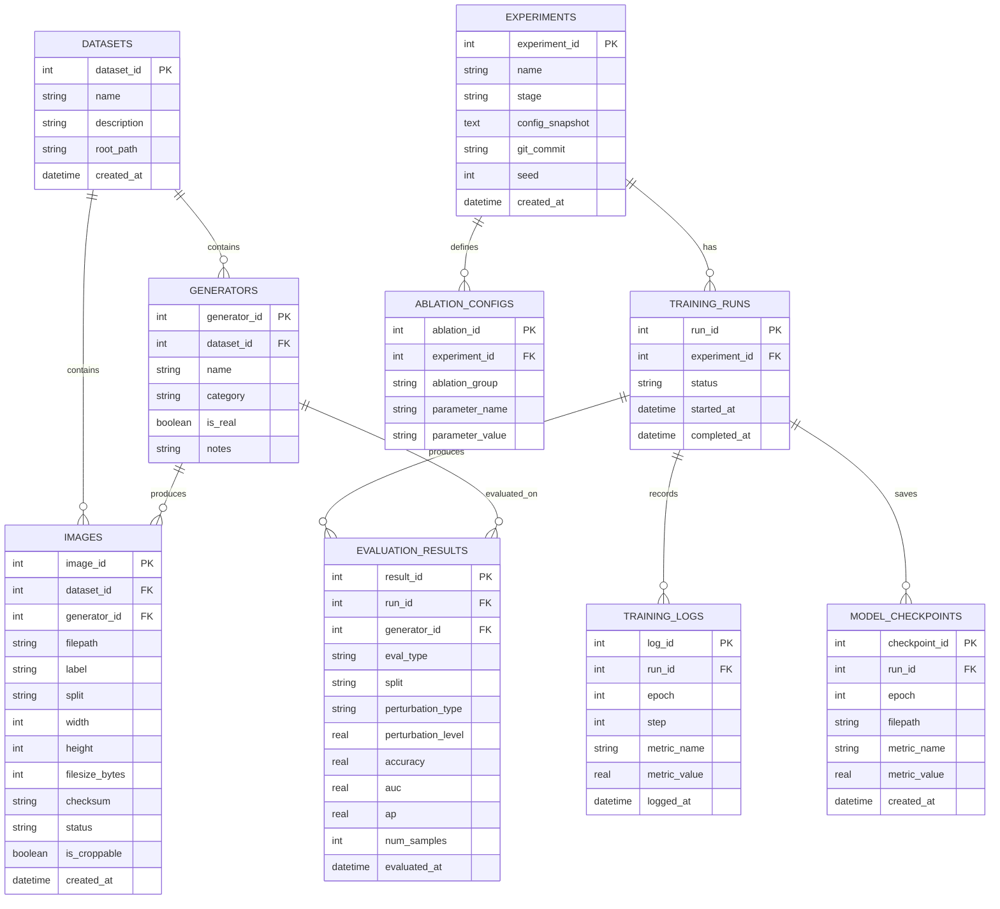

# DB設計書：DCCT（Color Matters）再現実装

**担当ロール:** db-designer
**参照元:** 01_要件定義書（NFR-6, NFR-7）, 02_基本設計書, 03_詳細設計書
**DBMS:** SQLite（ファイルベース、単一マシンでの研究用途を想定）
**作成日:** 2026年9月
**ステータス:** 草稿

---

## 1. 設計方針

- 学習データ本体（画像ファイル）は外部SSD（Extreme Pro）上に置いたまま、**パス参照のみ**をDBで管理する（画像バイナリはDB化しない）。
- 実験（config・seed・ステージ）、学習ログ、チェックポイント、評価結果を一元管理し、後から「どの設定でどの結果が出たか」を追跡できるようにする（NFR-7対応）。
- アブレーション（Table 4相当）およびロバスト性評価（Figure 6相当）も同じスキーマの中で「評価結果の一種」として扱えるよう、`evaluation_results` を汎用化する。
- 卒業研究の次フェーズ（3枝統合、DRCT-2M追加）を見据え、`datasets` / `generators` をマスタ化し拡張しやすくする。

## 2. ER図



## 3. テーブル定義

### 3.1 `datasets`

| カラム | 型 | 制約 | 説明 |
|---|---|---|---|
| dataset_id | INTEGER | PK, AUTOINCREMENT | データセットID |
| name | TEXT | NOT NULL, UNIQUE | 例: `GenImage`, `DRCT-2M`（将来拡張） |
| description | TEXT | | 概要説明 |
| root_path | TEXT | NOT NULL | 外部SSD上のルートパス（例: `/Volumes/Extreme Pro/`） |
| created_at | TEXT | NOT NULL DEFAULT (現在時刻) | 登録日時 |

### 3.2 `generators`

| カラム | 型 | 制約 | 説明 |
|---|---|---|---|
| generator_id | INTEGER | PK, AUTOINCREMENT | 生成器ID |
| dataset_id | INTEGER | FK → datasets.dataset_id, NOT NULL | 所属データセット |
| name | TEXT | NOT NULL | 例: `Midjourney`, `SDv1.4`, `SDv1.5`, `ADM`, `GLIDE`, `Wukong`, `VQDM`, `BigGAN`, `ImageNet(real)` |
| category | TEXT | NOT NULL | `real` / `gan` / `diffusion` |
| is_real | INTEGER | NOT NULL (0/1) | 実写画像か否か |
| notes | TEXT | | 備考（データ取得状況等。例: Midjourneyは未取得【OI-1】） |

### 3.3 `images`

| カラム | 型 | 制約 | 説明 |
|---|---|---|---|
| image_id | INTEGER | PK, AUTOINCREMENT | 画像ID |
| dataset_id | INTEGER | FK → datasets.dataset_id, NOT NULL | |
| generator_id | INTEGER | FK → generators.generator_id, NOT NULL | |
| filepath | TEXT | NOT NULL, UNIQUE | 外部SSD上の絶対（または相対）パス |
| label | TEXT | NOT NULL | `real` / `ai` |
| split | TEXT | NOT NULL | `train` / `val` / `test` |
| width | INTEGER | | 画素幅 |
| height | INTEGER | | 画素高さ |
| filesize_bytes | INTEGER | | ファイルサイズ |
| checksum | TEXT | | 重複検出・整合性確認用ハッシュ |
| status | TEXT | NOT NULL DEFAULT 'valid' | `valid` / `invalid`（破損画像等） |
| is_croppable | INTEGER | NOT NULL DEFAULT 1 (0/1) | 64×64クロップ可能か |
| created_at | TEXT | NOT NULL DEFAULT (現在時刻) | 登録日時 |

### 3.4 `experiments`

| カラム | 型 | 制約 | 説明 |
|---|---|---|---|
| experiment_id | INTEGER | PK, AUTOINCREMENT | 実験ID |
| name | TEXT | NOT NULL | 実験名（人間可読） |
| stage | TEXT | NOT NULL | `stage1_photo` / `stage1_ai` / `stage2_classifier` / `ablation` / `robustness` |
| config_snapshot | TEXT | NOT NULL | 実行時configの内容（YAML/JSON文字列としてそのまま保存） |
| git_commit | TEXT | | 実行時のコードバージョン |
| seed | INTEGER | | 乱数シード |
| created_at | TEXT | NOT NULL DEFAULT (現在時刻) | |

### 3.5 `training_runs`

| カラム | 型 | 制約 | 説明 |
|---|---|---|---|
| run_id | INTEGER | PK, AUTOINCREMENT | 実行ID |
| experiment_id | INTEGER | FK → experiments.experiment_id, NOT NULL | |
| status | TEXT | NOT NULL DEFAULT 'running' | `running` / `completed` / `failed` |
| started_at | TEXT | NOT NULL | |
| completed_at | TEXT | | |

### 3.6 `training_logs`

| カラム | 型 | 制約 | 説明 |
|---|---|---|---|
| log_id | INTEGER | PK, AUTOINCREMENT | |
| run_id | INTEGER | FK → training_runs.run_id, NOT NULL | |
| epoch | INTEGER | NOT NULL | |
| step | INTEGER | | ミニバッチ単位のステップ（任意） |
| metric_name | TEXT | NOT NULL | 例: `nll_loss`, `bce_loss`, `lr` |
| metric_value | REAL | NOT NULL | |
| logged_at | TEXT | NOT NULL DEFAULT (現在時刻) | |

### 3.7 `model_checkpoints`

| カラム | 型 | 制約 | 説明 |
|---|---|---|---|
| checkpoint_id | INTEGER | PK, AUTOINCREMENT | |
| run_id | INTEGER | FK → training_runs.run_id, NOT NULL | |
| epoch | INTEGER | NOT NULL | |
| filepath | TEXT | NOT NULL | チェックポイントファイルの保存先 |
| metric_name | TEXT | | 保存基準となった指標名（例: `val_nll`） |
| metric_value | REAL | | |
| created_at | TEXT | NOT NULL DEFAULT (現在時刻) | |

### 3.8 `evaluation_results`

| カラム | 型 | 制約 | 説明 |
|---|---|---|---|
| result_id | INTEGER | PK, AUTOINCREMENT | |
| run_id | INTEGER | FK → training_runs.run_id, NOT NULL | どの学習実行に対する評価か |
| generator_id | INTEGER | FK → generators.generator_id, NOT NULL | 評価対象の生成器（cross-generator評価用） |
| eval_type | TEXT | NOT NULL | `cross_generator` / `ablation` / `robustness` |
| split | TEXT | NOT NULL | `test` 等 |
| perturbation_type | TEXT | | `none` / `jpeg` / `downsample`（ロバスト性評価用） |
| perturbation_level | REAL | | QF値や倍率（ロバスト性評価用） |
| accuracy | REAL | | |
| auc | REAL | | |
| ap | REAL | | |
| num_samples | INTEGER | | 評価に使用したサンプル数 |
| evaluated_at | TEXT | NOT NULL DEFAULT (現在時刻) | |

### 3.9 `ablation_configs`

| カラム | 型 | 制約 | 説明 |
|---|---|---|---|
| ablation_id | INTEGER | PK, AUTOINCREMENT | |
| experiment_id | INTEGER | FK → experiments.experiment_id, NOT NULL | |
| ablation_group | TEXT | NOT NULL | `A`(条件付きモデル構成) / `B`(モデル構造) / `C`(truncation閾値) / `D`(fine-tuning) |
| parameter_name | TEXT | NOT NULL | 例: `truncation_t`, `use_high_pass`, `freeze_conditional_models` |
| parameter_value | TEXT | NOT NULL | 文字列化した値（例: `"7"`, `"true"`） |

## 4. DDL（SQLite）

```sql
PRAGMA foreign_keys = ON;

CREATE TABLE datasets (
    dataset_id   INTEGER PRIMARY KEY AUTOINCREMENT,
    name         TEXT NOT NULL UNIQUE,
    description  TEXT,
    root_path    TEXT NOT NULL,
    created_at   TEXT NOT NULL DEFAULT (datetime('now'))
);

CREATE TABLE generators (
    generator_id INTEGER PRIMARY KEY AUTOINCREMENT,
    dataset_id   INTEGER NOT NULL REFERENCES datasets(dataset_id),
    name         TEXT NOT NULL,
    category     TEXT NOT NULL CHECK (category IN ('real','gan','diffusion')),
    is_real      INTEGER NOT NULL CHECK (is_real IN (0,1)),
    notes        TEXT,
    UNIQUE(dataset_id, name)
);

CREATE TABLE images (
    image_id       INTEGER PRIMARY KEY AUTOINCREMENT,
    dataset_id     INTEGER NOT NULL REFERENCES datasets(dataset_id),
    generator_id   INTEGER NOT NULL REFERENCES generators(generator_id),
    filepath       TEXT NOT NULL UNIQUE,
    label          TEXT NOT NULL CHECK (label IN ('real','ai')),
    split          TEXT NOT NULL CHECK (split IN ('train','val','test')),
    width          INTEGER,
    height         INTEGER,
    filesize_bytes INTEGER,
    checksum       TEXT,
    status         TEXT NOT NULL DEFAULT 'valid' CHECK (status IN ('valid','invalid')),
    is_croppable   INTEGER NOT NULL DEFAULT 1 CHECK (is_croppable IN (0,1)),
    created_at     TEXT NOT NULL DEFAULT (datetime('now'))
);

CREATE TABLE experiments (
    experiment_id   INTEGER PRIMARY KEY AUTOINCREMENT,
    name            TEXT NOT NULL,
    stage           TEXT NOT NULL CHECK (stage IN ('stage1_photo','stage1_ai','stage2_classifier','ablation','robustness')),
    config_snapshot TEXT NOT NULL,
    git_commit      TEXT,
    seed            INTEGER,
    created_at      TEXT NOT NULL DEFAULT (datetime('now'))
);

CREATE TABLE training_runs (
    run_id         INTEGER PRIMARY KEY AUTOINCREMENT,
    experiment_id  INTEGER NOT NULL REFERENCES experiments(experiment_id),
    status         TEXT NOT NULL DEFAULT 'running' CHECK (status IN ('running','completed','failed')),
    started_at     TEXT NOT NULL DEFAULT (datetime('now')),
    completed_at   TEXT
);

CREATE TABLE training_logs (
    log_id       INTEGER PRIMARY KEY AUTOINCREMENT,
    run_id       INTEGER NOT NULL REFERENCES training_runs(run_id),
    epoch        INTEGER NOT NULL,
    step         INTEGER,
    metric_name  TEXT NOT NULL,
    metric_value REAL NOT NULL,
    logged_at    TEXT NOT NULL DEFAULT (datetime('now'))
);

CREATE TABLE model_checkpoints (
    checkpoint_id INTEGER PRIMARY KEY AUTOINCREMENT,
    run_id        INTEGER NOT NULL REFERENCES training_runs(run_id),
    epoch         INTEGER NOT NULL,
    filepath      TEXT NOT NULL,
    metric_name   TEXT,
    metric_value  REAL,
    created_at    TEXT NOT NULL DEFAULT (datetime('now'))
);

CREATE TABLE evaluation_results (
    result_id           INTEGER PRIMARY KEY AUTOINCREMENT,
    run_id               INTEGER NOT NULL REFERENCES training_runs(run_id),
    generator_id          INTEGER NOT NULL REFERENCES generators(generator_id),
    eval_type            TEXT NOT NULL CHECK (eval_type IN ('cross_generator','ablation','robustness')),
    split                TEXT NOT NULL,
    perturbation_type    TEXT DEFAULT 'none',
    perturbation_level   REAL,
    accuracy             REAL,
    auc                  REAL,
    ap                   REAL,
    num_samples          INTEGER,
    evaluated_at         TEXT NOT NULL DEFAULT (datetime('now'))
);

CREATE TABLE ablation_configs (
    ablation_id     INTEGER PRIMARY KEY AUTOINCREMENT,
    experiment_id   INTEGER NOT NULL REFERENCES experiments(experiment_id),
    ablation_group  TEXT NOT NULL CHECK (ablation_group IN ('A','B','C','D')),
    parameter_name  TEXT NOT NULL,
    parameter_value TEXT NOT NULL
);
```

## 5. インデックス設計

```sql
CREATE INDEX idx_images_generator     ON images(generator_id);
CREATE INDEX idx_images_split_label   ON images(split, label);
CREATE INDEX idx_training_logs_run    ON training_logs(run_id, epoch);
CREATE INDEX idx_checkpoints_run      ON model_checkpoints(run_id);
CREATE INDEX idx_evalresults_run      ON evaluation_results(run_id);
CREATE INDEX idx_evalresults_gen_type ON evaluation_results(generator_id, eval_type);
CREATE INDEX idx_ablation_experiment  ON ablation_configs(experiment_id);
```

## 6. 典型的なクエリ例

**学習対象（train split）の写真画像一覧を取得:**
```sql
SELECT image_id, filepath
FROM images
JOIN generators USING (generator_id)
WHERE images.split = 'train'
  AND images.label = 'real'
  AND images.status = 'valid';
```

**特定run_idのcross-generator評価結果を生成器別に集計:**
```sql
SELECT g.name AS generator, er.accuracy, er.auc, er.ap
FROM evaluation_results er
JOIN generators g ON g.generator_id = er.generator_id
WHERE er.run_id = :run_id
  AND er.eval_type = 'cross_generator'
ORDER BY g.name;
```

**アブレーションC（truncation閾値）の結果一覧:**
```sql
SELECT ac.parameter_value AS truncation_t,
       AVG(er.accuracy) AS mean_accuracy
FROM ablation_configs ac
JOIN experiments e   ON e.experiment_id = ac.experiment_id
JOIN training_runs r ON r.experiment_id = e.experiment_id
JOIN evaluation_results er ON er.run_id = r.run_id
WHERE ac.ablation_group = 'C'
  AND ac.parameter_name = 'truncation_t'
  AND er.eval_type = 'ablation'
GROUP BY ac.parameter_value;
```

**ロバスト性評価（JPEG圧縮）の劣化強度別Accuracy推移:**
```sql
SELECT er.perturbation_level AS jpeg_qf,
       AVG(er.accuracy) AS mean_accuracy
FROM evaluation_results er
WHERE er.eval_type = 'robustness'
  AND er.perturbation_type = 'jpeg'
GROUP BY er.perturbation_level
ORDER BY er.perturbation_level DESC;
```

## 7. 運用方針

- **マイグレーション:** スキーマ変更はマイグレーションスクリプト（例: `migrations/0001_init.sql`, `0002_add_ablation_configs.sql`）で管理し、DBファイル本体を直接手編集しない。
- **バックアップ:** `db/dcct_metadata.sqlite3` は学習・評価バッチ実行前後にタイムスタンプ付きでコピーを保存する（例: `db/backups/dcct_metadata_20260915.sqlite3`）。
- **同時実行:** SQLiteの制約上、複数プロセスからの同時書き込みは避け、学習・評価ジョブは基本的に逐次実行とする。並列実行が必要な場合は書き込みをキューイングする軽量ラッパーを`MetadataRepository`に設ける。
- **将来拡張:** DRCT-2M追加時は `datasets` に新規レコードを追加するのみでスキーマ変更は不要となるよう設計している。
