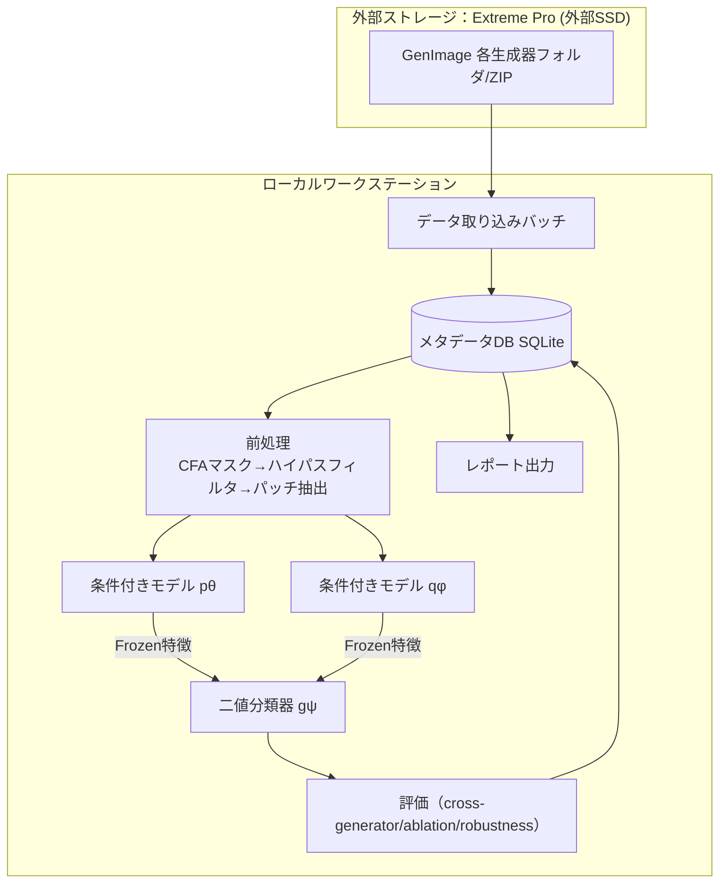
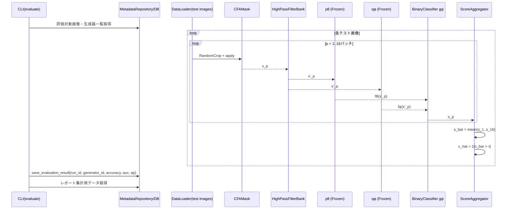
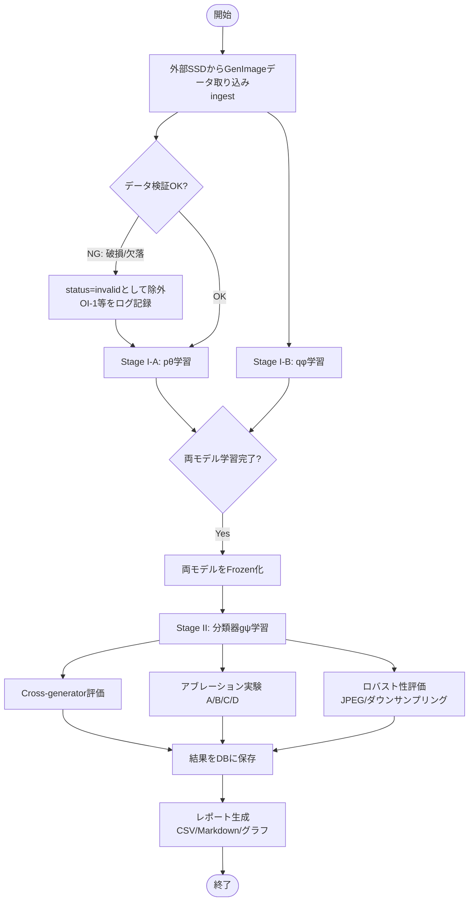
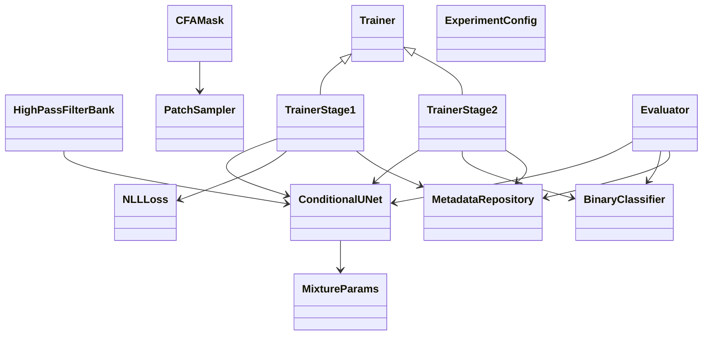
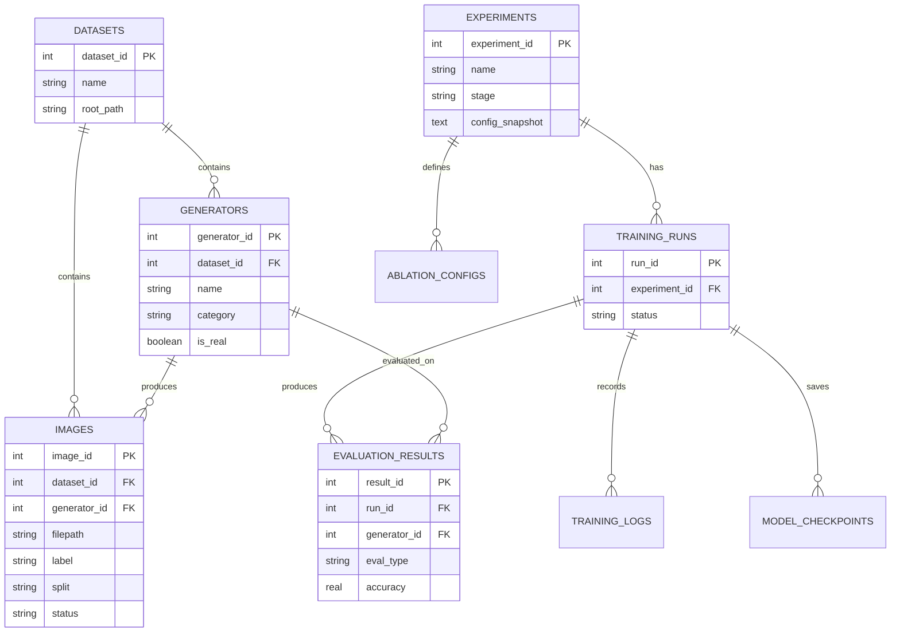
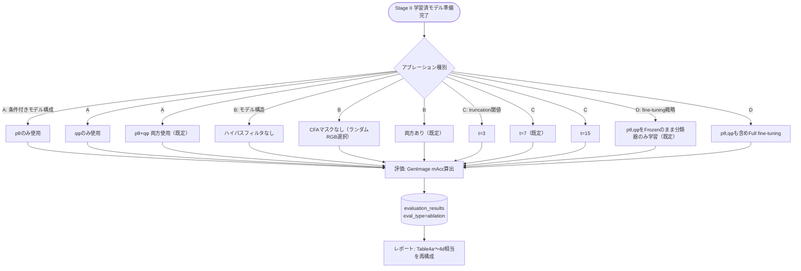

# 図表集：DCCT（Color Matters）再現実装

**担当ロール:** diagram-writer
**表記法:** Mermaid記法
**参照元:** 01_要件定義書, 02_基本設計書, 03_詳細設計書, 04_DB設計書
**作成日:** 2026年9月

本書は、他4文書に登場する図をシーケンス図・フローチャート中心に集約し、実装時に参照しやすい形でまとめたものである。

---

## 1. システム構成図



---

## 2. シーケンス図：Stage I-A / I-B（条件付き分布モデル学習）

```mermaid
sequenceDiagram
    participant CLI as CLI(train-stage1)
    participant Cfg as ExperimentConfig
    participant Repo as MetadataRepository/DB
    participant Loader as DataLoader
    participant CFA as CFAMask
    participant HPF as HighPassFilterBank
    participant Net as ConditionalUNet(fθ or fφ)
    participant Loss as NLLLoss
    participant Opt as Optimizer(Adam)

    CLI->>Cfg: load(config.yaml)
    CLI->>Repo: register_experiment(config_snapshot)
    Repo-->>CLI: experiment_id
    CLI->>Repo: create training_run
    Repo-->>CLI: run_id

    loop 各epoch
        loop 各mini-batch
            Loader->>Repo: 対象画像パス取得(split=train, label=photo|ai)
            Repo-->>Loader: image paths
            Loader->>Loader: RandomCrop(64x64)
            Loader->>CFA: apply(image)
            CFA-->>Loader: x, y
            Loader->>HPF: apply(x) / apply(y)
            HPF->>HPF: truncate(-t, t)
            HPF-->>Net: x'
            HPF-->>Loss: y'
            Net->>Net: forward(x') -> {w,mu,s}
            Net-->>Loss: MixtureParams
            Loss->>Loss: NLL計算
            Loss-->>Opt: loss
            Opt->>Net: パラメータ更新
        end
        CLI->>Repo: log_training_metric(run_id, epoch, nll_loss)
        CLI->>Repo: save_checkpoint_meta(run_id, epoch, path)
    end

    CLI->>Repo: update training_run status=completed
    Note over Net: 学習収束後、パラメータをFrozenにして<br/>Stage IIへ引き渡す
```

---

## 3. シーケンス図：Stage II（二値分類器学習）

```mermaid
sequenceDiagram
    participant CLI as CLI(train-stage2)
    participant Repo as MetadataRepository/DB
    participant Loader as DataLoader
    participant CFA as CFAMask
    participant HPF as HighPassFilterBank
    participant Pth as pθ (Frozen)
    participant Phi as qφ (Frozen)
    participant Cls as BinaryClassifier gψ
    participant Loss as BCELoss
    participant Opt as Optimizer(Adam)

    CLI->>Repo: register_experiment / create training_run
    Repo-->>CLI: run_id

    loop 各epoch
        loop 各mini-batch (image, label c)
            Loader->>CFA: RandomCrop + apply(image)
            CFA-->>HPF: x
            HPF-->>Pth: x'
            HPF-->>Phi: x'
            Pth-->>Cls: fθ(x')
            Phi-->>Cls: fφ(x')
            Cls->>Cls: forward(Concat(fθ(x'), fφ(x')))
            Cls-->>Loss: c_hat, c
            Loss-->>Opt: BCE loss
            Opt->>Cls: パラメータ更新（pθ,qφは更新しない）
        end
        CLI->>Repo: log_training_metric(run_id, epoch, bce_loss)
        CLI->>Repo: save_checkpoint_meta(run_id, epoch, path)
    end
    CLI->>Repo: update training_run status=completed
```

---

## 4. シーケンス図：推論・評価フェーズ



---

## 5. 全体処理フローチャート



---

## 6. クラス図



*(詳細なメソッドシグネチャは 03_詳細設計書 の2節を参照)*

---

## 7. ER図（DB設計書 再掲・参照用）



*(完全なカラム定義・DDLは 04_DB設計書 を参照)*

---

## 8. アブレーション実験の分岐フローチャート（Table 4対応）


